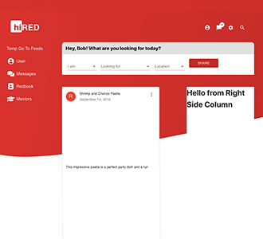

# hiRED

hiRED is a full stack web application that connects students with alumni mentors. There is a list of available mentors that a student can filter based on their skills, name, and program. The student can then decide whether they want to chat with the mentor and make an appointment. Students can also upload their work and projects in order to display their portfolio.

Starting server in Linux: sudo NODE_ENV=development yarn start:dev# hiRED

## Technoloogies used: 

* React Js
* Redux
* Apollo
* GraphQL
* Express
* PostGreSQL
* Git

## Software used in this Project:

* Visual Studio Code
* GitHub
* Google Chrome Developer Tools

## Developed by:
Alam Talash & five classmates

@: RED Academy Toronto

#### Date: May 2019
